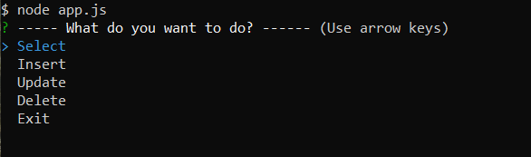
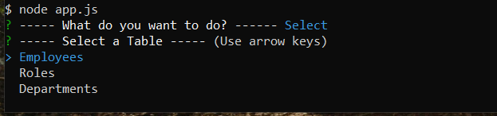
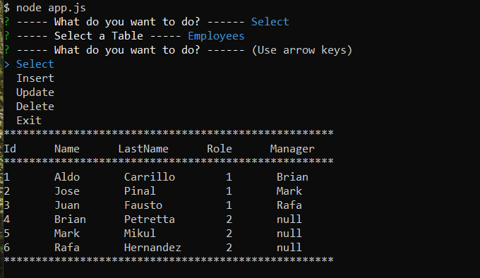

# HW12-EmployeeTracker

## Description

This project does you can track the employees of a company, where you can have:

- Employees
- Roles
- Departments

Each of this you can insert a new one, edit or delete.

## Table of contents

- [Installation](#installation)
- [Usage](#usage)
- [Test](#test)
- [Credits](#credits)
- [License](#license)
- [Questiones](#Questiones)

## Installation

Run the terminal the main file called "app.js" with Node.

## Usage

- To Display the Table of Employess, Roles or Departments: Selecte in the Menu "Select" then the table you want to take a look.
- To Insert a new Employee, Role or Department: Select in te Menu "Insert" then the table where you want a new record.
- To Edit a Employee, Role or Departement: Select in the Menu "Update" then the table where you want a to edit a record.
- To Delete a Employee, Role or Department: Select in the Menu "Delete" then the table where you want a delete a record.

#### New Employee

    * Id
    * Name
    * Last Name
    * Role
    * Manager

#### New Role

    * Id
    * Title
    * Salary
    * Department

#### New Department

    * Id
    * Name

## Test

"Node server.js"

"Menu:" Select

"Table" Employees

## Main Menu

### Example Tables

### Example Employees

### Video

## Credits

- Aldo Carrillo

## License

MIT License

Copyright (c) 2020 Aldo Carrillo

Permission is hereby granted, free of charge, to any person obtaining a copy
of this software and associated documentation files (the "Software"), to deal
in the Software without restriction, including without limitation the rights
to use, copy, modify, merge, publish, distribute, sublicense, and/or sell
copies of the Software, and to permit persons to whom the Software is
furnished to do so, subject to the following conditions:

The above copyright notice and this permission notice shall be included in all
copies or substantial portions of the Software.

THE SOFTWARE IS PROVIDED "AS IS", WITHOUT WARRANTY OF ANY KIND, EXPRESS OR
IMPLIED, INCLUDING BUT NOT LIMITED TO THE WARRANTIES OF MERCHANTABILITY,
FITNESS FOR A PARTICULAR PURPOSE AND NONINFRINGEMENT. IN NO EVENT SHALL THE
AUTHORS OR COPYRIGHT HOLDERS BE LIABLE FOR ANY CLAIM, DAMAGES OR OTHER
LIABILITY, WHETHER IN AN ACTION OF CONTRACT, TORT OR OTHERWISE, ARISING FROM,
OUT OF OR IN CONNECTION WITH THE SOFTWARE OR THE USE OR OTHER DEALINGS IN THE
SOFTWARE.

## Questiones

- GitHub link: https://github.com/AldoCarrillo
- Email: aldo.carrillo22@gmail.com
